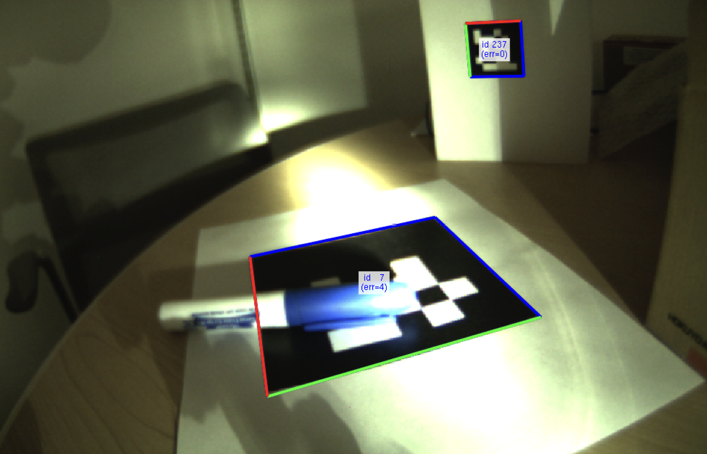

An important task in robotics is to uniquely identify features and landmarks over time as a robot navigates through the environment. The process can help estimate the robotics position (localization) to ultimately be able to perform robust path planning and navigation. In this tutorial, we will explore a popular open-source library for AprilTag detection and 3D pose estimation from a single monorcular camera. 

AprilTags (shown in the figure below) are a form of fiducial markers that are designed with predefined sizes and patterns. The benefit of knowing their size is pose estimation given that a perspective mapping between two planes can be described by a Homography $\mathbf{H}$ matrix. In this case, $\mathbf{H}$ can describe a mapping between the camera frame and the marker since both can be assumed to be flat surfaces. This makes AprilTags an easy way of performing 3D pose estimation of objects with a single monocular camera by simply placing an AprilTag on the object. In addition, the unique pattern that defines each marker can help differentiate multiple markers that may be observable at a particular instance and by leveraging the concept of Hamming distance and dictionaries, error detection and correction can be performed in the event that part of a marker is occluded.

